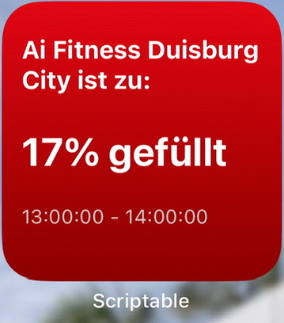

# ai-fitness-widget
IOS-Widget für wie voll dein AI Fitness (all inclusive Fitness) ist mit der [Scriptable](https://scriptable.app/) App.

## Installation

1. Kopiere GymStatus.js in deine Scriptable App
2. Führe das Skript einmal in der Scriptable App aus (nicht als Widget), um dein Studio auszuwählen
3. Füge ein neues Scriptable Widget zu deinem Homescreen hinzu
4. Wähle GymStatus.js als Skript für das Widget aus
5. Das Widget aktualisiert sich automatisch alle 15 Minuten, um die aktuelle Studioauslastung anzuzeigen

### Vorschau
| Heller Modus | Dunkler Modus |
|--------------|---------------|
|  |  |

